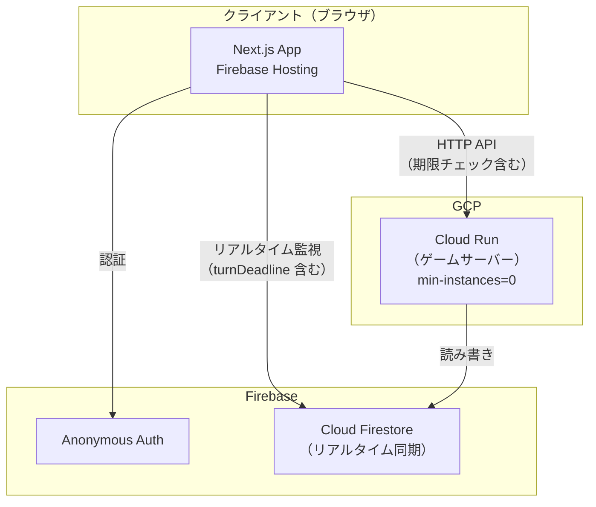

# 泥沼の妨害 (doronuma_sabotage) 実装計画

## 概要

「泥沼ボードゲームシリーズ」の第一弾として、妨害を主体としたオンラインボードゲーム「泥沼の妨害 (doronuma_sabotage)」を実装する。既存の Next.js 16 + TailwindCSS v4 プロジェクトをベースに、Firebase（Hosting / Firestore / Anonymous Auth）と Cloud Run を組み合わせたフルスタックアーキテクチャで構築する。

> [!IMPORTANT]
> このプロジェクトは「泥沼ボードゲームシリーズ」のルートリポジトリであり、将来的に別のボードゲームも追加される前提で、共通基盤とゲーム固有ロジックを分離した設計とする。

---

## レビュー反映事項

以下はレビューにより確定した設計方針です。

| 項目 | 決定内容 |
|:---|:---|
| TailwindCSS v4 | 採用確定。仕様書 (`doronuma_sabotage_game_system.md`) に追記済み |
| ドメイン | デフォルトの `*.web.app` を使用。カスタムドメインは設定しない |
| プレイヤー名 | ホストは部屋作成時、ホスト以外は部屋参加時に入力 |
| オブザーバー機能 | 初回リリースに含む（通信切断者の扱いがオブザーバー前提で設計されているため） |
| CI/CD | 初回リリースに含む。infrastructure.md に詳細手順を記載済み |
| 時間管理 | Cloud Scheduler / `setTimeout` は不使用。**遅延評価（Lazy Evaluation）方式**で実現 |

---

## 全体アーキテクチャ



### 時間管理: 遅延評価（Lazy Evaluation）方式

Cloud Run はリクエストが来ない間はスリープ状態（CPU 未割り当て）になるため、`setTimeout` は予定通りの時間に発火しません。そのため、**Firestore に記録した `turnDeadline` を真実の源泉とし、次にリクエストが届いた時点で期限超過を遡って処理する**方式を採用します。

```
[ターン開始]
  │
  ├─→ サーバー: Firestore に turnDeadline を書き込む
  ├─→ クライアント全員: onSnapshot で turnDeadline を受信、カウントダウン表示開始
  │
  ├─ (a) プレイヤーが時間内に行動:
  │     └─→ サーバー: 行動を処理、次のターンへ
  │
  └─ (b) 制限時間超過:
        ├─→ クライアント（他プレイヤー）: カウントダウン 0 時に
        │   POST /api/games/:roomId/check-timeout を自動送信
        └─→ サーバー: 期限チェックミドルウェアが turnDeadline と現在時刻を比較
              ├─ 超過 → タイムアウト処理を実行
              └─ 未超過 → 何もしない
```

**メリット:**
- `min-instances=0` で運用可能（追加コストゼロ）
- `setTimeout` / Cloud Scheduler 不要
- Firestore のサーバータイムスタンプが基準のため、クライアント時刻に依存しない
- 全員切断時も、再接続時に未処理タイムアウトを遡って処理（連鎖的に複数ターン分処理される場合あり）

---

## Proposed Changes

### Phase 0: プロジェクト基盤整備

本フェーズではモノレポ化・共通型定義・開発環境の構築を行う。

---

#### [MODIFY] [package.json](file:///c:/GitHub/doronuma_boradgame/package.json)
- npm workspaces を導入し、`packages/frontend`、`packages/backend`、`packages/shared` を管理する
- ルートの `scripts` にワークスペース横断コマンドを追加

#### [NEW] packages/shared/package.json
- 共有パッケージ `@doronuma/shared` を定義
- ゲームロジックの型定義・定数・バリデーションを格納

#### [NEW] packages/shared/src/types/game.ts
- ゲーム全体の型定義
  - `GameRoom`: 部屋情報（roomId, hostId, settings, status, players）
  - `Player`: プレイヤー情報（playerId, name, score, hand, status）
  - `PlayerStatus`: プレイヤー状態の Union型（`"waiting"` | `"ready"` | `"playing"` | `"afk"` | `"observer"`）
  - `ActionCard`: 行動カードの型（type, id）
  - `VictoryPointCard`: 勝利点カードの型（points）
  - `GameState`: ゲーム状態（phase, currentTurn, deck, discardPile, interruptQueue, suddenDeathTriggered, actionCountPerPlayer）
  - `TurnAction`: ターンアクションのUnion型（drawTwo, drawOnePlayOne, discardPlayTwo, pass）
  - `InterruptAction`: 割り込みアクションの型
  - `DiscardAction`: 手札超過時の捨てカード選択の型

#### [NEW] packages/shared/src/types/firestore.ts
- Firestore のドキュメント構造に対応する型定義
  - `RoomDocument`: rooms コレクションのドキュメント
  - `PlayerDocument`: players サブコレクションのドキュメント
  - `GameStateDocument`: gameState サブコレクションのドキュメント
  - `ActionLogEntry`: actionLog サブコレクションのドキュメント

#### [NEW] packages/shared/src/constants/cards.ts
- 行動カードの定数定義
  - カード種類の Enum（Harassment, Accomplice, Barrage, Nullify, Deflect, DoubleBack, Plunder, CutDown, SuddenDeath）
  - 各カードの枚数定義（50枚の内訳）
  - 勝利点カードの確率分布（マイナス80%、ゼロ15%、プラス5%）

#### [NEW] packages/shared/src/constants/game.ts
- ゲームルールの定数
  - `MAX_HAND_SIZE`: 5
  - `MIN_PLAYERS` / `MAX_PLAYERS`: 3〜5
  - `DEFAULT_TURN_TIME`: 15秒
  - `DEFAULT_INTERRUPT_TIME`: 10秒
  - `INITIAL_HAND_SIZES`: [3, 4, 5, 5, 5]
  - `SUDDEN_DEATH_PENALTY_DRAWS`: 3
  - `AFK_THRESHOLD`: 2（連続タイムアウト回数）

#### [NEW] packages/shared/src/validation/actions.ts
- アクション実行可能判定のユーティリティ関数
  - `canDrawTwo()`: 山札に2枚以上あるか
  - `canDrawOnePlayOne()`: 山札に1枚以上 & 手札に1枚以上
  - `canDiscardPlayTwo()`: 手札に3枚以上（捨て1枚 + 使用2枚）
  - `getAvailableActions()`: 実行可能なアクション一覧を返す
  - `needsDiscard(handSize)`: 手札が上限を超えているか判定

---

### Phase 1: フロントエンド（ロビー画面）

仕様書の[ロビー画面設計](file:///c:/GitHub/doronuma_boradgame/docs/sabotage/doronuma_sabotage_lobby.md)に基づいて実装する。

> **プレイヤー名の入力:** ホストは部屋作成時、その他のプレイヤーは部屋参加時にプレイヤー名を入力する。標準の HTML `<input>` 要素はブラウザの IME（日本語入力）をネイティブにサポートしているため、TailwindCSS でスタイリングした通常のフォームで日本語入力に対応する。もし開発中に日本語入力で問題が発生した場合は、Chakra UI v3 等のコンポーネントライブラリの導入を検討し、仕様書に追記する。

---

#### [MODIFY] [layout.tsx](file:///c:/GitHub/doronuma_boradgame/app/layout.tsx)
- メタデータを「泥沼の妨害」に更新
- `lang` を `ja` に変更
- Firebase 初期化のプロバイダーを追加

#### [MODIFY] [page.tsx](file:///c:/GitHub/doronuma_boradgame/app/page.tsx)
- デフォルトの Next.js テンプレートを削除
- トップページ（部屋作成 or 参加の選択画面）を実装
  - 「部屋を作る」ボタン + ホスト名入力フォーム
  - 「合言葉を入力して参加」フォーム + プレイヤー名入力フォーム
  - ゲームタイトル・ロゴ表示

#### [NEW] app/room/[roomId]/page.tsx
- ロビー画面のメインページ
- Firestore の `rooms/{roomId}` をリアルタイム監視
- GameContext Provider で状態を管理

#### [NEW] app/room/[roomId]/play/page.tsx
- ゲーム画面のメインページ
- ゲーム開始後にリダイレクト
- オブザーバーモード対応（ゲーム開始後に参加した場合は閲覧のみ）

#### [NEW] app/components/lobby/RoomHeader.tsx
- 部屋ID（合言葉）表示コンポーネント
- コピー機能付き

#### [NEW] app/components/lobby/PlayerList.tsx
- 参加プレイヤー一覧コンポーネント
- Ready 状態の表示
- 最大5人の枠表示（空きスロット含む）
- オブザーバーの一覧表示

#### [NEW] app/components/lobby/ReadyButton.tsx
- Ready（準備完了）ボタン
- トグル式（Ready OK ↔ 準備中）

#### [NEW] app/components/lobby/HostControls.tsx
- ホスト専用コントロールパネル
- 設定変更ボタン
- ゲーム開始ボタン（全員 Ready 時のみ有効化）

#### [NEW] app/components/lobby/GameSettings.tsx
- ルール設定モーダル / パネル（ホストのみ操作可能）
  - 募集人数（3〜5人）
  - 1ターンの制限時間
  - 割り込みの選択時間
  - 突然死カードの範囲
  - 山札の内訳

---

### Phase 2: フロントエンド（ゲーム画面）

仕様書の[ゲーム画面設計](file:///c:/GitHub/doronuma_boradgame/docs/sabotage/doronuma_sabotage_playing.md)に基づいて実装する。

---

#### [NEW] app/components/game/GameBoard.tsx
- ゲーム画面全体のレイアウトコンポーネント
- 左側（プレイエリア）+ 右側（ゲーム情報）+ 下部（プレイヤーエリア）の3分割
- オブザーバーモード時は下部エリアを「観戦中」表示に切り替え

#### [NEW] app/components/game/PlayArea.tsx
- 中央左のプレイエリア
- 山札（残り枚数表示）
- 捨て札エリア
- 現在実行中のカード表示

#### [NEW] app/components/game/GameInfoPanel.tsx
- 右側のゲーム情報パネル
- 制限時間タイマー
- プレイヤー情報一覧
- 行動ログ

#### [NEW] app/components/game/Timer.tsx
- 制限時間カウントダウンタイマー
- **Firestore の `turnDeadline` タイムスタンプを基準に、クライアント側でカウントダウンを表示**
- カウントダウンが 0 に達したら、自動的に `POST /api/games/:roomId/check-timeout` を送信
- 自分の番 / 割り込み受付時にアクティブ化

#### [NEW] app/components/game/PlayerInfo.tsx
- 個別プレイヤーの情報表示
- 名前、点数、手札枚数、状態（手番 / 空席 / オブザーバー）
- 対象選択モード時の「決定」ボタン表示
- **空席（AFK）プレイヤーも攻撃対象として選択可能**（ルール「空席のプレイヤーを攻撃の対象にすることは可能」に対応）

#### [NEW] app/components/game/ActionLog.tsx
- 行動ログのリアルタイム表示
- スクロール可能なリスト

#### [NEW] app/components/game/PlayerHand.tsx
- 下部のプレイヤー手札エリア
- アクションボタン（2枚引いて終了 / 1枚引いて1枚使う / 捨てて2枚使う / パス）
- 手札カード表示（対象選択中はグレーアウト）
- オブザーバーモード時は非表示

#### [NEW] app/components/game/CardComponent.tsx
- 個別カードの表示コンポーネント
- カード種類に応じたデザイン
- 選択状態・使用不可状態の表現
- **捨てカード選択モード時の選択可能状態**

#### [NEW] app/components/game/TargetSelection.tsx
- 対象選択モードのUI
- 「右側のリストから攻撃する相手を選んでください」メッセージ
- 「選ぶのをやめる」ボタン
- **空席（AFK）プレイヤーも攻撃対象として選択可能**（「空席」ラベル付きで表示、選択ボタンは有効）

#### [NEW] app/components/game/DiscardSelection.tsx
- **手札超過時の捨てカード選択UI**（新規追加）
- 手札が上限の5枚を超えた場合に表示される
- カードを引いた後に手札が上限を超えた際、プレイヤーが自分で捨てるカードを選ぶ画面
- 「以下のカードを捨ててください（X枚選択してください）」メッセージ
- 手札から捨てるカードをタップ/クリックで選択（選択したカードにはチェックマーク表示）
- 必要枚数を選んだ後に「確定」ボタンを押して捨て札を確定
- 選択中はカウントダウンタイマーが動作し、時間切れの場合はランダムに捨てる

#### [NEW] app/components/game/InterruptOverlay.tsx
- 割り込み発生時のオーバーレイUI
- 割り込みカウントダウン表示
- 割り込みカード選択UI
- オブザーバーは閲覧のみ

#### [NEW] app/components/game/GameResult.tsx
- ゲーム終了時の結果表示
- 順位・点数一覧（空席プレイヤーは強制最下位）
- 「ロビーに戻る」ボタン

#### [NEW] app/components/game/ObserverBanner.tsx
- オブザーバー（見学者）用のバナー表示
- 「見学中 - 操作できません」メッセージ
- ゲーム終了後にロビーに戻れる旨の案内

---

### Phase 3: Firebase 連携（認証 + Firestore）

---

#### [NEW] app/lib/firebase/config.ts
- Firebase の初期化設定
- 環境変数から API キー等を読み込み

#### [NEW] app/lib/firebase/auth.ts
- Firebase Anonymous Auth の匿名認証ラッパー
- `signInAnonymously()` の呼び出し
- セッション永続化（`browserLocalPersistence`）
- 画面を閉じても同じユーザーとして復帰可能

#### [NEW] app/lib/firebase/firestore.ts
- Firestore のクライアント操作ラッパー
- `onSnapshot` によるリアルタイム監視ヘルパー

#### [NEW] app/contexts/AuthContext.tsx
- 認証状態を管理する React Context
- 匿名ログイン済みかどうかの状態
- `playerId`（= Firebase UID）の管理

#### [NEW] app/contexts/GameContext.tsx
- ゲーム状態を管理する React Context
- Firestore リアルタイムリスナーの統合
- ゲーム状態の変更検知と画面更新
- オブザーバー状態の管理
- **手札超過状態 (`needsDiscard`) の検知と `DiscardSelection` 表示切り替え**

#### [NEW] app/hooks/useRoom.ts
- ルーム情報の購読・操作カスタムフック
- `createRoom(hostName)`, `joinRoom(roomId, playerName)`, `toggleReady()`, `startGame()`

#### [NEW] app/hooks/useGameState.ts
- ゲーム状態の購読カスタムフック
- Firestore のリアルタイム監視
- 画面表示用のデータ変換

#### [NEW] app/hooks/useGameActions.ts
- ゲームアクション実行カスタムフック
- Cloud Run API の呼び出しラッパー
- `executeTurn()`, `playInterrupt()`, `selectTarget()`, `submitDiscard()`, `checkTimeout()`

---

### Phase 4: バックエンド（Cloud Run ゲームサーバー）

---

#### [NEW] packages/backend/package.json
- Cloud Run サーバーのパッケージ定義
- 依存: express, firebase-admin, @doronuma/shared

#### [NEW] packages/backend/src/index.ts
- Express サーバーのエントリポイント
- ルーティング定義

#### [NEW] packages/backend/src/routes/room.ts
- ルーム関連の API エンドポイント
  - `POST /api/rooms`: 部屋作成（合言葉生成、ホスト名登録）
  - `POST /api/rooms/:roomId/join`: 部屋参加（プレイヤー名登録）
  - `POST /api/rooms/:roomId/ready`: Ready トグル
  - `POST /api/rooms/:roomId/start`: ゲーム開始
  - `PATCH /api/rooms/:roomId/settings`: 設定変更（ホストのみ）

#### [NEW] packages/backend/src/routes/game.ts
- ゲーム進行の API エンドポイント
  - `POST /api/games/:roomId/action`: ターンアクション実行
  - `POST /api/games/:roomId/interrupt`: 割り込みカード使用
  - `POST /api/games/:roomId/select-target`: 対象選択
  - `POST /api/games/:roomId/discard`: **手札超過時の捨てカード選択**（新規追加）
  - `POST /api/games/:roomId/check-timeout`: **タイムアウトチェック**（クライアントからの遅延評価トリガー）

#### [NEW] packages/backend/src/services/deck.ts
- 山札管理サービス
  - `createDeck(settings)`: 山札の生成（行動カード50枚、突然死カードの配置）
  - `drawCard(deck)`: カードを1枚引く
  - `drawVictoryCard()`: 勝利点カードの抽選（確率分布に基づく）
  - `shuffleDeck()`: シャッフル

#### [NEW] packages/backend/src/services/gameEngine.ts
- ゲーム進行エンジン
  - `initializeGame()`: ゲーム開始時の初期化（山札作成、手札配布、`actionCountPerPlayer` 初期化）
  - `executeTurnAction()`: ターンアクションの処理
    - **カード引き後に手札が5枚を超えた場合、`needsDiscard` フラグを立てて捨てカード選択を待つ**
  - `handleDiscard()`: **プレイヤーが選んだ捨てカードを処理し、手札を5枚以下にする**（新規追加）
  - `processInterrupt()`: 割り込み処理（スタック方式・後出し有利の逆順処理）
  - `resolveInterruptStack()`: 割り込みスタックの解決
  - `checkGameEnd()`: ゲーム終了判定（詳細はラストラウンド処理の項を参照）
  - `calculateFinalScores()`: 最終スコア計算（空席プレイヤーは強制最下位）

#### [NEW] packages/backend/src/services/turnManager.ts
- ターン管理サービス
  - `startTurn()`: ターン開始処理（Firestore に `turnDeadline` を書き込み）
  - `endTurn()`: ターン終了処理（`actionCountPerPlayer` を更新、次のプレイヤーへ）
  - `handleTimeout()`: タイムアウト時の強制処理（カードを2枚引き、上限に合わせて**ランダムに**捨てる）
  - `handleAfk()`: AFK 判定（連続2回タイムアウトで空席化）
  - `skipAfkPlayer()`: 空席プレイヤーの即時自動処理（時間を待たず一瞬で「2枚引いてランダムに捨てる」を実行、`actionCountPerPlayer` を更新）
  - `advanceToNextPlayer()`: 次のプレイヤーに進む処理（空席プレイヤーは連続スキップ）

#### [NEW] packages/backend/src/services/interruptManager.ts
- 割り込み管理サービス
  - `startInterruptWindow()`: 割り込み受付開始（Firestore に `interruptDeadline` を書き込み）
  - `addInterrupt()`: 割り込みカード追加（`interruptDeadline` をリセット）
  - `resolveInterrupts()`: 割り込みスタックの逆順解決
  - 対象カードごとの効果処理:
    - `完全無効`: 自分への攻撃を打ち消し / 行動自体キャンセル
    - `なすりつけ`: 対象の振り替え
    - `倍返し`: 攻撃無効化 + 攻撃者にペナルティ
  - **空席プレイヤーへの攻撃も正常に処理**（勝利点カードの引き・点数計算を実行）

#### [NEW] packages/backend/src/services/deadlineChecker.ts
- **遅延評価（Lazy Evaluation）による期限チェックサービス**（`timerManager.ts` から名称変更）
  - `checkAndProcessExpiredDeadlines(roomId)`: Firestore の `turnDeadline` / `interruptDeadline` を確認し、期限超過していれば処理を実行
    - `turnDeadline` が過去 → `handleTimeout()` を実行 → 次のターンへ進む → 連鎖チェック（次のプレイヤーも空席なら即スキップ）
    - `interruptDeadline` が過去 → `resolveInterrupts()` を実行
  - `deadlineCheckMiddleware()`: **全ゲーム API に適用する Express ミドルウェア**。リクエスト処理前に期限チェックを挿入

#### [NEW] packages/backend/src/services/lastRoundManager.ts
- **突然死後のラストラウンド管理サービス**（新規追加）
  - 突然死カードが引かれた後の「ラストターン保証」ロジックを担当
  - 詳細な処理フロー:
    1. 突然死カードが引かれた瞬間:
       - `suddenDeathTriggered = true` を設定
       - `suddenDeathTriggeredBy` に引いたプレイヤーIDを記録
       - 引いたプレイヤーに勝利点カード3枚のペナルティを適用
       - `targetActionCount` を計算（その時点での全プレイヤーの最大行動回数）
       - `phase` を `"lastRound"` に変更
    2. ラストラウンド中のターン進行:
       - `advanceToNextPlayer()` で次のプレイヤーに進む際、そのプレイヤーの `actionCountPerPlayer[playerId]` が `targetActionCount` に達していれば**スキップ**
       - 空席プレイヤーの番が来た場合は「2枚引いてランダムに捨てる」の即時自動処理を行い、`actionCountPerPlayer` を加算してスキップ
    3. ゲーム終了判定:
       - `isLastRoundComplete()`: 全プレイヤーの `actionCountPerPlayer` が `targetActionCount` に達しているか判定
       - 達していれば `phase` を `"finished"` に変更し、最終スコア計算へ

#### [NEW] packages/backend/src/services/hostManager.ts
- ホスト管理サービス
  - `transferHost()`: ホストの切断・空席化時に、残りの参加者からランダムに新しいホストを選出
  - `isHost()`: ホスト判定

#### [NEW] packages/backend/src/middleware/auth.ts
- Firebase Auth トークン検証ミドルウェア
- リクエストからプレイヤーIDの抽出

#### [NEW] packages/backend/src/middleware/deadlineCheck.ts
- **期限チェックミドルウェア**（新規追加）
- ゲーム関連の全 API エンドポイント (`/api/games/*`) に適用
- リクエスト処理の前に `deadlineChecker.checkAndProcessExpiredDeadlines()` を呼び出し
- 期限超過があれば先にタイムアウト処理を実行してから、本来のリクエストを処理

#### [NEW] packages/backend/Dockerfile
- Cloud Run 用の Docker イメージ定義
- Node.js ベースの軽量イメージ

#### [NEW] packages/backend/tsconfig.json
- バックエンド用の TypeScript 設定

---

### Phase 5: Firestore データ設計

Firestore のコレクション構造と Security Rules を定義する。

---

#### [NEW] firestore.rules
```
rooms/{roomId}
  ├── roomId: string           // 合言葉（例: "1234-5678"）
  ├── hostId: string           // ホストの playerId
  ├── status: "lobby" | "playing" | "finished"
  ├── settings: {
  │     maxPlayers: number,      // 3〜5
  │     turnTimeLimit: number,   // 秒
  │     interruptTimeLimit: number,
  │     suddenDeathRange: number,  // 突然死を混ぜる範囲
  │     deckConfig: object        // 山札の内訳
  │   }
  ├── createdAt: timestamp
  │
  ├── players/{playerId}
  │     ├── name: string         // プレイヤー名（作成時 or 参加時に入力）
  │     ├── status: "waiting" | "ready" | "playing" | "afk" | "observer"
  │     ├── score: number
  │     ├── handCount: number    // 公開情報（手札の枚数）
  │     ├── joinedAt: timestamp
  │     └── consecutiveTimeouts: number
  │
  ├── gameState (single document)
  │     ├── phase: "setup" | "playing" | "interrupt" | "lastRound" | "finished"
  │     │          // ※ "discarding" サブフェーズは needsDiscard フラグで表現
  │     ├── currentTurnPlayerId: string
  │     ├── turnOrder: string[]
  │     ├── turnNumber: number
  │     ├── deckRemaining: number
  │     ├── discardCount: number
  │     ├── suddenDeathTriggered: boolean
  │     ├── suddenDeathTriggeredBy: string | null
  │     ├── lastRoundFinalPlayerId: string | null  // (互換性のため残置)
  │     ├── targetActionCount: number | null        // ラストラウンドの目標行動回数
  │     ├── actionCountPerPlayer: { [playerId: string]: number }  // 各プレイヤーの行動回数
  │     ├── turnDeadline: timestamp   // サーバー時刻ベース（遅延評価の基準）
  │     ├── interruptDeadline: timestamp | null
  │     ├── currentAction: object | null  // 実行中のアクション
  │     ├── interruptStack: object[]      // 割り込みスタック
  │     ├── needsDiscard: boolean         // 手札超過の捨てカード選択中フラグ
  │     └── discardPlayerId: string | null // 捨てカード選択中のプレイヤーID
  │
  ├── hands/{playerId} (private - Security Rules で本人のみ読み取り)
  │     └── cards: ActionCard[]
  │
  └── actionLog/{logId}
        ├── type: string
        ├── playerId: string
        ├── targetPlayerId: string | null
        ├── cardType: string | null
        ├── message: string
        └── timestamp: timestamp
```

#### [NEW] firestore.indexes.json
- actionLog の timestamp 順ソート用インデックス

---

### Phase 6: CI/CD パイプライン

---

#### [NEW] cloudbuild.yaml
- Cloud Build による自動ビルド・デプロイ設定
- GitHub の `main` ブランチへの push をトリガー
- パイプラインの流れ:
  1. `npm ci` で依存パッケージインストール
  2. `@doronuma/shared` のビルド
  3. Lint & Type Check
  4. ユニットテスト実行
  5. フロントエンドビルド → Firebase Hosting デプロイ
  6. バックエンド Docker ビルド → Cloud Run デプロイ
- 詳細は [infrastructure.md](file:///c:/GitHub/doronuma_boradgame/docs/infrastructure.md) セクション 9 に記載

---

### Phase 7: ドキュメント作成

---

#### [MODIFY] [environment.md](file:///c:/GitHub/doronuma_boradgame/docs/environment.md)
- 開発環境構築の完全ガイド（作成済み、Phase 0 完了後に必要に応じて更新）

#### [MODIFY] [infrastructure.md](file:///c:/GitHub/doronuma_boradgame/docs/infrastructure.md)
- GCP / Firebase インフラ構築の完全ガイド（作成済み、遅延評価方式のアーキテクチャ記載済み）

#### [MODIFY] [README.md](file:///c:/GitHub/doronuma_boradgame/README.md)
- ゲームの概要、docs の説明を追加（作成済み）

---

## ディレクトリ構成（最終形）

```
doronuma_boradgame/
├── README.md
├── package.json                    # npm workspaces ルート
├── cloudbuild.yaml                 # CI/CD パイプライン定義
├── packages/
│   ├── shared/                     # 共有型定義・定数
│   │   ├── package.json
│   │   ├── tsconfig.json
│   │   └── src/
│   │       ├── types/
│   │       │   ├── game.ts
│   │       │   └── firestore.ts
│   │       ├── constants/
│   │       │   ├── cards.ts
│   │       │   └── game.ts
│   │       └── validation/
│   │           └── actions.ts
│   │
│   └── backend/                    # Cloud Run ゲームサーバー
│       ├── package.json
│       ├── tsconfig.json
│       ├── Dockerfile
│       └── src/
│           ├── index.ts
│           ├── routes/
│           │   ├── room.ts
│           │   └── game.ts
│           ├── services/
│           │   ├── deck.ts
│           │   ├── gameEngine.ts
│           │   ├── turnManager.ts
│           │   ├── interruptManager.ts
│           │   ├── deadlineChecker.ts   # 遅延評価による期限チェック
│           │   ├── lastRoundManager.ts  # 突然死後のラストラウンド管理
│           │   └── hostManager.ts
│           └── middleware/
│               ├── auth.ts
│               └── deadlineCheck.ts     # 期限チェックミドルウェア
│
├── app/                            # Next.js フロントエンド（既存）
│   ├── layout.tsx
│   ├── page.tsx                    # トップ（部屋作成/参加 + プレイヤー名入力）
│   ├── globals.css
│   ├── room/
│   │   └── [roomId]/
│   │       ├── page.tsx            # ロビー画面
│   │       └── play/
│   │           └── page.tsx        # ゲーム画面
│   ├── components/
│   │   ├── lobby/
│   │   │   ├── RoomHeader.tsx
│   │   │   ├── PlayerList.tsx
│   │   │   ├── ReadyButton.tsx
│   │   │   ├── HostControls.tsx
│   │   │   └── GameSettings.tsx
│   │   └── game/
│   │       ├── GameBoard.tsx
│   │       ├── PlayArea.tsx
│   │       ├── GameInfoPanel.tsx
│   │       ├── Timer.tsx
│   │       ├── PlayerInfo.tsx
│   │       ├── ActionLog.tsx
│   │       ├── PlayerHand.tsx
│   │       ├── CardComponent.tsx
│   │       ├── TargetSelection.tsx
│   │       ├── DiscardSelection.tsx   # 手札超過時の捨てカード選択
│   │       ├── InterruptOverlay.tsx
│   │       ├── GameResult.tsx
│   │       └── ObserverBanner.tsx
│   ├── contexts/
│   │   ├── AuthContext.tsx
│   │   └── GameContext.tsx
│   ├── hooks/
│   │   ├── useRoom.ts
│   │   ├── useGameState.ts
│   │   └── useGameActions.ts
│   └── lib/
│       └── firebase/
│           ├── config.ts
│           ├── auth.ts
│           └── firestore.ts
│
├── docs/
│   ├── environment.md              # 開発環境構築ガイド
│   ├── infrastructure.md           # GCP/Firebase 構築ガイド
│   └── sabotage/
│       ├── doronuma_sabotage_game_spec.md
│       ├── doronuma_sabotage_game_system.md
│       ├── doronuma_sabotage_playing.md
│       └── doronuma_sabotage_lobby.md
│
├── firebase.json                   # Firebase Hosting 設定
├── .firebaserc                     # Firebase プロジェクト設定
├── firestore.rules                 # Firestore Security Rules
├── firestore.indexes.json          # Firestore インデックス
│
├── next.config.ts
├── tsconfig.json
├── eslint.config.mjs
├── postcss.config.mjs
├── .gitignore
└── LICENSE
```

---

## 実装の優先順位

| 順序 | フェーズ | 内容 | 依存 |
|:---:|:---:|:---|:---|
| 1 | Phase 0 | プロジェクト基盤整備（モノレポ化・型定義） | なし |
| 2 | Phase 5 | Firestore データ設計（スキーマ・ルール） | Phase 0 |
| 3 | Phase 3 | Firebase 連携（認証・Firestore クライアント） | Phase 0 |
| 4 | Phase 1 | ロビー画面 UI（プレイヤー名入力含む） | Phase 0, 3 |
| 5 | Phase 4 | バックエンド（ルーム管理 API + 期限チェックミドルウェア） | Phase 0, 5 |
| 6 | Phase 4 | バックエンド（ゲームエンジン + ラストラウンド管理 + 捨てカード処理） | Phase 5 |
| 7 | Phase 2 | ゲーム画面 UI（捨てカード選択・オブザーバー表示含む） | Phase 3, 4 |
| 8 | Phase 6 | CI/CD パイプライン | Phase 0〜5 完了後 |
| 9 | Phase 7 | ドキュメント更新 | 全フェーズ並行可 |

---

## ゲームロジック詳細: 突然死後のラストラウンド処理

> [!IMPORTANT]
> ルール「全員の行動回数が同じになった時点で終了」を正確に実装するための処理フロー。

### 前提データ

- `actionCountPerPlayer`: 各プレイヤーの行動回数（ターン開始時にカウント）
- `targetActionCount`: 突然死発生時点での全プレイヤーの最大行動回数
- `turnOrder`: プレイヤーの行動順序

### 処理フロー

```
突然死カード引かれる
  │
  ├─ ペナルティ処理（引いたプレイヤーに勝利点カード3枚）
  ├─ targetActionCount = max(actionCountPerPlayer)
  ├─ phase = "lastRound"
  │
  └─ 通常通りターン進行を続ける
       │
       ├─ advanceToNextPlayer() で次のプレイヤーを決定
       │    │
       │    ├─ 次のプレイヤーの actionCount >= targetActionCount
       │    │   └─ このプレイヤーはスキップ（行動回数が目標に達済み）
       │    │
       │    ├─ 次のプレイヤーが空席 (AFK)
       │    │   └─ 即時自動処理（2枚引いてランダムに捨てる）
       │    │      actionCount を加算してスキップ
       │    │
       │    └─ 次のプレイヤーが通常
       │        └─ ターン開始、turnDeadline を書き込み
       │
       └─ isLastRoundComplete() で毎ターン判定
            │
            ├─ 全員の actionCount >= targetActionCount
            │   └─ ゲーム終了 → phase = "finished"
            │
            └─ まだ未達のプレイヤーがいる
                └─ ターン進行を継続
```

### エッジケース

| ケース | 処理 |
|:---|:---|
| 突然死を引いたのが最後のプレイヤー | 残りのプレイヤーは全員行動回数が1少ないため、全員が1ターンずつ行動して終了 |
| ラストラウンド中にプレイヤーが空席化 | そのプレイヤーの残りターンは即時自動処理で消化。ゲーム終了時に強制最下位 |
| 全員が空席になった | 全員のターンが即時自動処理で連鎖的に消化され、即座にゲーム終了 |
| 突然死を引いたプレイヤーが1番目の人 | `targetActionCount` は全員同じ値。以降の全プレイヤーが1ターンずつ行動して終了 |

---

## Verification Plan

### Automated Tests

#### ゲームロジックのユニットテスト
```bash
npm run test --workspace=packages/shared
npm run test --workspace=packages/backend
```

- **山札生成テスト**: カード枚数・突然死カードの位置が正しいか
- **勝利点カード抽選テスト**: 確率分布が仕様通りか（統計的検証）
- **ターンアクション判定テスト**: 各条件でのアクション実行可否
- **手札超過テスト**: 手札が5枚を超えた場合に `needsDiscard` フラグが立つか
- **捨てカード処理テスト**: プレイヤーが選んだカードが正しく捨てられ、手札が5枚以下になるか
- **空席プレイヤー攻撃テスト**: 空席プレイヤーへの「単なる嫌がらせ」「集中砲火」等が正しく処理されるか
- **割り込み解決テスト**: スタック方式の逆順処理が正しいか
- **ゲーム終了判定テスト**: 突然死 → ラストターン保証の動作
- **ラストラウンド詳細テスト**:
  - `targetActionCount` の計算が正しいか
  - 行動回数が目標に達したプレイヤーがスキップされるか
  - ラストラウンド中にプレイヤーが空席化した場合の即時自動処理
  - 全員が空席の場合の連鎖消化
- **AFK 判定テスト**: 連続タイムアウトでの空席化
- **遅延評価テスト**: `deadlineChecker` が期限超過を正しく検知し、タイムアウト処理を実行するか
- **ホスト移譲テスト**: ホスト切断時の自動選出

#### フロントエンドテスト
```bash
npm run test --workspace=doronuma_boradgame
```

- **コンポーネントの描画テスト**: 各画面コンポーネントが正しく表示されるか
- **状態遷移テスト**: ロビー → ゲーム → 結果の画面遷移
- **オブザーバーモードテスト**: 操作不可の状態が正しく表示されるか
- **捨てカード選択UIテスト**: `DiscardSelection` が正しく表示され、カード選択・確定が動作するか
- **タイマーテスト**: `turnDeadline` に基づくカウントダウンが正しく動作し、0到達時に `check-timeout` が送信されるか

#### Lint & Type Check
```bash
npm run lint
npx tsc --noEmit
```

### Manual Verification

- **ローカル環境での統合テスト**: Firebase Emulator Suite を使用して、認証 → 部屋作成（ホスト名入力）→ 参加（プレイヤー名入力）→ ゲーム進行 → 終了の一連のフローを手動確認
- **マルチプレイヤーテスト**: 複数ブラウザタブで3〜5人のプレイを模擬
- **タイムアウトテスト（遅延評価）**: 制限時間超過後にクライアントが `check-timeout` を送信し、サーバーが正しくタイムアウト処理を実行するか
- **全員切断テスト**: 全プレイヤーがブラウザを閉じた後、1人が再接続した際に未処理タイムアウトが遡って処理されるか
- **手札超過テスト**: 「2枚引いて終了」で手札が6枚以上になった際に、捨てカード選択画面が表示され、選択後に手札が5枚になるか
- **空席プレイヤー攻撃テスト**: 対象選択画面で空席プレイヤーを選択し、攻撃が正しく処理されるか
- **割り込みテスト**: 複数人の割り込みが正しく解決されるか
- **突然死ラストラウンドテスト**: 突然死発動後、全員の行動回数が同じになるまでゲームが続き、正しく終了するか
- **切断・復帰テスト**: ブラウザを閉じて再接続した際にオブザーバーとして復帰するか
- **ホスト切断テスト**: ホストが切断された際に新しいホストが自動選出されるか
- **オブザーバーテスト**: ゲーム開始後に部屋IDで入室した場合、閲覧のみとなるか
- **CI/CD テスト**: `main` ブランチへの push で自動デプロイが動作するか
- **日本語入力テスト**: プレイヤー名入力で日本語（ひらがな・カタカナ・漢字）が正しく入力できるか
